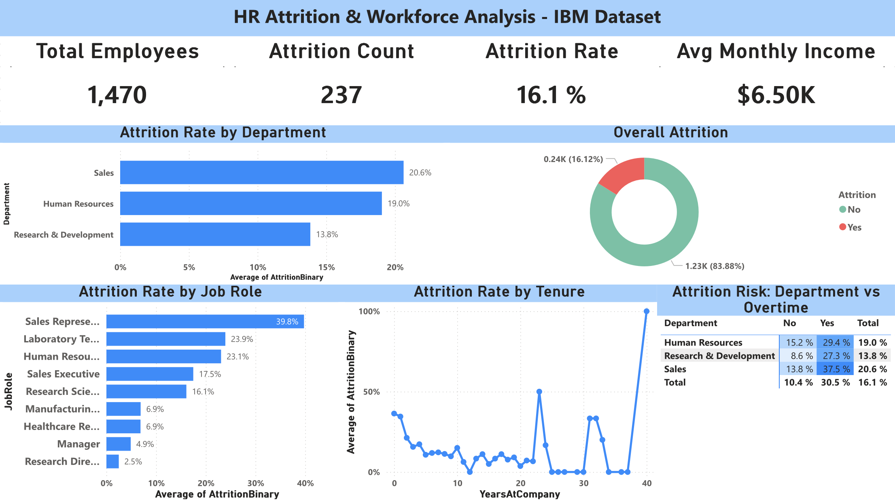

# HR Attrition & Workforce Performance Analysis


## Project Overview
This project analyses employee attrition and workforce performance using the IBM HR Analytics dataset — a widely used fictional dataset containing 1,470 employees across 35 variables. The goal is to identify the key drivers of attrition and provide actionable recommendations to help HR leadership reduce employee turnover.

**Business Question:** *Why are employees leaving, and what can the company do to retain them?*

---

## Tech Stack
| Tool | Purpose |
|------|---------|
| Python (Pandas, NumPy) | Data loading, cleaning, feature engineering |
| Matplotlib & Seaborn | Exploratory data analysis & visualizations |
| SQLite | Relational database & business SQL queries |
| Power BI Service | Interactive executive dashboard |

---

## Dataset
- **Source:** [IBM HR Analytics Dataset — Kaggle](https://www.kaggle.com/datasets/pavansubhasht/ibm-hr-analytics-attrition-dataset)
- **Size:** 1,470 employees × 35 columns
- **Type:** Fictional dataset created by IBM data scientists
- **Key columns:** Age, Department, JobRole, MonthlyIncome, OverTime, JobSatisfaction, WorkLifeBalance, YearsAtCompany, Attrition

---

## Project Structure
```
hr-attrition-analysis/
│
├── data/
│   └── hr_attrition_cleaned.csv                 # Cleaned dataset
│
├── notebooks/
│   └── hr_attrition_analysis.ipynb              # Full analysis notebook
│
├── sql/
│   └── hr_queries.sql                           # 8 business SQL queries
│
├── outputs/
│   ├── chart1_attrition_overview.png
│   ├── chart2_age_overtime.png
│   ├── chart3_satisfaction_income.png
│   ├── chart4_worklife_years.png
│   ├── chart5_jobrole_heatmap.png
│   ├── hr_dashboard_screenshot.png
│   └── hr_dashboard.pdf
│
└── hr_attrition_dashboard.pbix                  # Power BI dashboard
```

---

## Executive Dashboard


---

## Key Findings

### Overall Attrition
- The company has a **16.1% attrition rate** — above the industry average of 10-15%
- **237 out of 1,470 employees** left the company

### Highest Risk Department
- **Sales** has the highest attrition at **20.6%**
- **Human Resources** follows at **19.0%**
- **R&D** is the healthiest at **13.8%**

### Highest Risk Job Role
- **Sales Representatives** have a **39.8% attrition rate** — nearly 1 in 2 are leaving
- **Research Directors** are the most stable at just **2.5%**

### Overtime is the Strongest Driver
- Employees working overtime leave at **30.5%** vs only **10.4%** for non-overtime workers
- **Sales + Overtime** is the most dangerous combination at **37.5%** attrition
- Overtime has the strongest positive correlation with attrition **(r = 0.25)**

### Age & Tenure Risk
- **18-25 year olds** have the highest attrition at **34.9%**
- **First year employees** are most at risk — **34.9% leave within 0-1 years**
- Attrition drops consistently with tenure, reaching just **8.1%** after 10+ years

### Compensation Gap
- Employees who left earned on average **$2,046 less per month** ($4,787 vs $6,833)
- Lower income is a consistent predictor of attrition across all departments

### Critical High-Risk Segment
- Employees who are **young (≤25) + working overtime + low job satisfaction** have a **73.3% attrition rate**
- This segment earns an average of only **$2,457/month**

---

## HR Recommendations

**1. Implement an Overtime Policy**
Overtime is the single strongest driver of attrition. Cap overtime hours, introduce overtime compensation reviews, and monitor burnout risk — especially in Sales where overtime attrition reaches 37.5%.

**2. Prioritize Early Tenure Onboarding**
34.9% of employees leave within their first year. Introduce structured 90-day and 6-month check-in programmes, assign mentors to new hires, and conduct stay interviews at the 6-month mark.

**3. Address Sales Representative Compensation**
With a 39.8% attrition rate, Sales Representatives are leaving at nearly double the company average. Review base salary benchmarks, improve commission structures, and conduct exit interview analysis specific to this role.

**4. Target the High-Risk Segment**
Young employees (≤25) working overtime with low job satisfaction have a 73.3% attrition rate. Introduce flexible working arrangements, salary reviews, and career development pathways specifically for this group.

**5. Invest in Career Development for Young Employees**
The 18-25 age group leaves at 34.9%. Structured career progression plans, mentorship programmes, and clear promotion timelines can significantly improve retention in this cohort.

---

## How to Run This Project

### Python Analysis
1. Clone this repository
2. Install dependencies:
```bash
pip install pandas numpy matplotlib seaborn jupyter openpyxl
```
3. Open `notebooks/hr_attrition_analysis.ipynb` in VS Code or Jupyter
4. Run all cells from top to bottom

### SQL Queries
1. Open `sql/hr_queries.sql` in any SQL editor
2. Connect to `sql/hr_attrition.db` using SQLite
3. Run individual queries to explore findings

### Power BI Dashboard
- Open `hr_attrition_dashboard.pbix` in Power BI Desktop, or
- View the exported dashboard at `outputs/hr_dashboard.pdf`

---

## Author
**Sanju Thomas Sabu**
Master of Business Analytics — University of Wollongong in Dubai
[LinkedIn](#) | [GitHub](#)

---
*Dataset: IBM HR Analytics Employee Attrition Dataset (fictional, created by IBM data scientists for educational purposes)*
